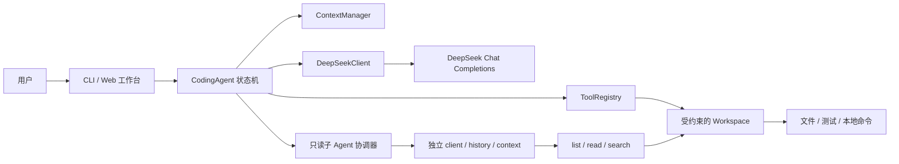

# ForgeLoop

一个直接基于 DeepSeek 原生 Tool Calling 构建的本地编程智能体。

[](https://github.com/zy576/agent/actions/workflows/ci.yml)

[](LICENSE)

ForgeLoop 可以读取指定工作区、修改代码、运行测试，并把 DeepSeek 的每次模型决策、工具调用和验证结果实时展示出来。项目不依赖 LangChain、LlamaIndex、OpenAI Agents SDK、AutoGen 或 CrewAI；Agent 循环、上下文管理、错误恢复、工具执行和完成状态机均在仓库中实现。

> 南京大学软件学院考核项目。运行时仅依赖 Python 标准库。

## 主要能力

- **三种使用方式**：本机 Web 工作台、单任务 CLI、连续追问的终端交互模式。
- **默认持续运行**：不再固定限制模型决策步骤，默认运行到模型完成或重复熔断触发。
- **真实工具调用**：通过 DeepSeek Chat Completions 的原生 `tools/tool_calls` 协议选择并调用工具。
- **实验性只读子 Agent**：可选地把一批独立调查任务并发交给最多四个只读子 Agent，主 Agent 仍是唯一写入者和验证者。
- **写后验证**：代码发生变化后，必须再次执行验证命令，才能正常报告完成。
- **可观察执行**：实时展示模型决策、文件操作、命令结果、验证状态和最终报告。
- **多轮上下文**：Web 与终端交互模式均保留历史，可在上一轮结果上继续修改或追问。
- **多工作区与多会话**：像 DeepSeek Harness 一样在左侧栏用树形视图管理多个工作区和会话——工作区组可展开收起、悬停出现「＋」直接在其中新建会话，会话行带状态点与相对时间（刚刚/n分钟/n小时…）、悬停显示完整路径与创建时间并可复制，支持搜索、重命名、分叉（复制历史为新会话）、归档/恢复与删除；每个会话的完整历史、验证状态与最近结果都持久化到本机（`~/.forgeloop/state.json`，可用 `FORGELOOP_DATA_DIR` 改位置），重启后照常恢复。
- **工作区边界**：文件工具只能访问指定 workspace，并拒绝 `.git`、`.env`、私钥及常见凭据文件。
- **动态工作区切换**：点击顶部「目标工作区」（或侧栏工作区旁的「＋」）会直接弹出 Windows **系统原生「浏览文件夹」对话框**，覆盖电脑上任意磁盘和文件夹，选完即把该文件夹设为目标工作区并进入其空白会话。切换与任务启动互斥；主智能体自身的 `select_workspace` 工具仍限定在当前工作区内。
- **清爽双主题界面**：浅色 / 深色自动适配；欢迎页以窗边图做柔和背景洗色、竖幅肖像做主视觉，主视觉旁的小宠物点击会互动回应，桌面与移动端响应式布局。
- **最小环境继承**：子进程默认拿不到 DeepSeek API Key 等秘密环境变量。

## 快速开始

### 1. 安装

需要 Python 3.10 或更高版本。

```bash
git clone https://github.com/zy576/agent.git
cd agent
python -m pip install -e .
```

### 2. 配置 DeepSeek API Key

PowerShell：

```powershell
$env:DEEPSEEK_API_KEY = "你的 DeepSeek API Key"
```

macOS / Linux：

```bash
export DEEPSEEK_API_KEY="你的 DeepSeek API Key"
```

Key 只从进程环境变量读取。请勿把真实 Key 写进仓库、任务文本或 transcript。

### 3. 打开 Web 工作台

```powershell
forgeloop --web --workspace "C:\path\to\your\project"
```

安装完成后，也可以使用 Python 模块入口直接运行：

```powershell
python -m forgeloop --web --workspace "C:\path\to\your\project"
```

ForgeLoop 会只监听 `127.0.0.1`，默认选择一个可用端口并自动打开浏览器。页面左侧是「工作区 / 会话」树形栏（顶部「新会话」按钮与「搜索会话…」，工作区组可展开、悬停出现「＋」在该工作区新建会话，会话行右侧悬停时间与「⋯」操作菜单互换），中间用于连续对话，右侧实时显示模型决策、工具调用、文件操作和验证结果，任务完成后汇总变更文件数量。工作区与全部会话历史持久化在本机 `~/.forgeloop/state.json`（可用 `FORGELOOP_DATA_DIR` 环境变量改位置），重启后自动恢复。同一时间只运行一个任务；若异常回合可能已经接触工作区，会话会安全关闭，并提示重启后先检查现场。

点击顶部「目标工作区」或侧栏「＋」会弹出系统原生的「浏览文件夹」对话框：选择任意磁盘上的任意文件夹（覆盖电脑全部位置）并确认后，该文件夹即成为目标工作区，同时进入它的空白会话；取消则保持现状。侧栏「新会话」按钮直接在当前工作区新建一个空白会话。切换工作区或会话都会恢复对应的完整历史与状态，不会修改或删除磁盘文件；任务执行期间禁止切换。界面随系统自动切换浅色 / 深色主题；欢迎页以窗边图做柔和背景、肖像做主视觉，主视觉旁的宠物可拖拽摆放、点击会互动回应。

常用 Web 参数：

```powershell
# 固定端口
forgeloop --web --workspace "C:\path\to\project" --port 8765

# 只打印访问地址，不自动打开浏览器
forgeloop --web --workspace "C:\path\to\project" --no-open
```

## 其他运行方式

### 单任务 CLI

```powershell
forgeloop --workspace "C:\path\to\project" "运行现有测试，定位失败原因并完成修复"
```

从 UTF-8 文件读取任务：

```powershell
forgeloop --workspace "C:\path\to\project" --task-file task.txt
```

### 终端交互模式

```powershell
forgeloop --interactive --workspace "C:\path\to\project"
```

每轮任务结束后可以继续追问。输入 `/help` 查看提示，输入 `/quit` 或 `/exit` 退出。

### 实验性只读子 Agent

通过 `--subagents N` 启用并行调查，`N` 取 `0` 到 `4`，默认 `0`（关闭）：

```powershell
forgeloop --web --subagents 3 --workspace "C:\path\to\project"
```

启用后，主 Agent 可以在一个主任务中委派至多一批相互独立的只读子任务。每个子 Agent 拥有独立的 DeepSeek client、消息历史和上下文预算，只能使用 `list_files`、`read_file`、`search_files`；每个子 Agent 默认不设固定步数、工具调用数和时长上限，运行到写出调查报告或重复熔断为止。结果经过长度限制后按输入顺序回传给主 Agent，由主 Agent 独占文件写入、命令执行、最终验证和完成判定。

子 Agent 使用线程并发，在途请求受单次请求超时约束。这是有界协作机制，不是操作系统沙箱。

若调查期间工作区被外部修改，或所有子任务均失败，委派会顶层失败，主 Agent 必须重新读取当前证据后才能结束；部分失败仍会保留其他成功报告。整批结果同时服从 `--max-tool-output-chars`。

## 持续运行与安全限制

ForgeLoop 默认没有模型决策步数上限，即 `max_steps=None`；工具调用总数和单轮运行时间同样默认不限。它会持续工作，直到模型提交最终报告，或重复调用熔断判定任务陷入死循环。相关预算与单次调用超时如下：

| 限制 | 默认值 | 作用 |
|---|---:|---|
| `--max-tool-calls` | 不限（可选） | 单轮任务允许的工具调用总数 |
| `--max-tool-calls-per-step` | `16` | 一次模型响应允许的工具调用数 |
| `--max-runtime-seconds` | 不限（可选） | 单轮运行时间预算（秒），在模型与工具调用边界检查 |
| `--request-timeout` | `90` | 单次模型请求超时 |
| `--command-timeout` | `120` | 单次本地命令超时 |
| `--subagents` | `0` | 实验性只读子 Agent 数量，范围 `0..4` |

显式配置预算时，总运行时间不会抢占正在进行的模型请求或工具调用，因此实际结束时间可能略超预算；在途调用仍分别受请求超时和命令超时约束。命令超时会终止该子进程并作为结构化工具错误返回，Agent 可以继续诊断或改用其他方案。

需要时也可以显式收紧预算：

```powershell
forgeloop --web --workspace "C:\path\to\project" `
  --max-tool-calls 512 `
  --max-runtime-seconds 3600
```

只有显式传入 `--max-steps N` 时才会启用模型决策步数限制：

```powershell
forgeloop --workspace "C:\path\to\project" --max-steps 48 "完成任务"
```

到达步数上限且最后一步使用了工具时，ForgeLoop 可能额外发起一次禁用工具的报告整理请求；该请求不能执行任何预算外操作。

重复调用熔断仍会生效。该限制用于避免失控死循环，并不等同于操作系统级沙箱。

## 配置

| 环境变量 | 是否必需 | 默认值 |
|---|---|---|
| `DEEPSEEK_API_KEY` | 是 | 无 |
| `DEEPSEEK_BASE_URL` | 否 | `https://api.deepseek.com` |
| `DEEPSEEK_MODEL` | 否 | `deepseek-v4-pro` |

也可以用 `--base-url` 和 `--model` 覆盖环境变量。Base URL 必须使用 HTTPS；只有 `localhost`、`127.0.0.1` 和 `::1` 允许 HTTP。

查看全部参数：

```bash
forgeloop --help
```

可用 `--quiet` 只显示最终报告，或用 `--transcript PATH` 新建一份尽力脱敏的纯文本执行轨迹。Transcript 不会覆盖已有文件，提交或分享前仍应人工检查。

## 内置工具

| 工具 | 用途 | 主要约束 |
|---|---|---|
| `list_files` | 查看工作区文件结构 | 跳过 VCS、依赖与缓存目录 |
| `read_file` | 分页读取 UTF-8 文本 | 行号与输出长度受限 |
| `search_files` | 文本或正则搜索 | 支持 glob，限制匹配数量 |
| `write_file` | 新建或整体写入文件 | 使用同目录临时文件原子落盘 |
| `replace_in_file` | 精确局部替换 | 匹配次数不符时拒绝写入 |
| `run_command` | 运行构建、测试和程序 | 使用参数数组、工作目录限制和超时 |
| `list_workspaces` | 查看当前工作区范围内的候选项目目录 | 只读，路径为范围相对路径 |
| `select_workspace` | 把活动工作区切换到当前工作区内的其他目录 | 拒绝逃逸范围、敏感目录与非目录 |

`list_workspaces` / `select_workspace` 只提供给主智能体；只读子 Agent 不包含这两个工具。切换后文件工具与命令工作目录立即指向新目录，成功事件会进入实时执行轨迹。用户在工作台里则可以像 DeepSeek Harness 那样把任意文件夹设为工作区（这属于用户显式授权，不受工具范围限制），之后智能体的 `select_workspace` 仍被限定在新工作区内。

工具失败会以结构化结果返回给模型，允许模型修改参数、诊断错误并继续处理。命令以非零状态退出属于可观察结果，不会直接击穿 Agent 主循环。

## 工作原理



一次循环包含：

1. 将系统策略、当前任务和经过预算控制的历史发送给模型。
2. 保存模型返回的完整 assistant 消息和 `tool_calls`。
3. 按 `tool_call_id` 执行工具，并把结构化结果追加到上下文。
4. 若模型结束但最新写入尚未验证，控制器会要求继续测试。
5. 模型返回无工具调用的最终报告后，本轮任务闭环。

启用子 Agent 时，主模型还可以发起一次批量只读委派；子结果作为普通工具结果进入主上下文，不会合并子 Agent 的内部历史。普通工具仍由主控制器顺序执行。

主 Agent 还可以用 `list_workspaces` 查看当前工作区内的候选项目，并用 `select_workspace` 把活动工作区换到当前工作区内的其他目录；切换成功会发出 `workspace_changed` 事件并进入执行轨迹。用户在界面里通过系统原生文件夹对话框选择任意文件夹（属于用户显式授权），与模型工具的目录切换是两套不同权限的路径。

完整设计见 [`docs/DESIGN.md`](docs/DESIGN.md)。

## 安全边界

- Web 服务仅绑定回环地址；所有请求校验回环来源和 Host，状态/事件接口要求随机令牌，提交任务还要求同源 Origin 与 JSON 内容类型；不启用 CORS。
- API Key、原始模型历史和完整工具消息只保留在 Python 后端，前端仅接收脱敏事件。
- 文件路径解析后必须位于 workspace；常见凭据目录、私钥、`.env` 和版本库内部文件不可读写。
- 用户可以在 Web 工作台把电脑上的任意普通文件夹设为工作区（相当于用 `--workspace` 重新指定，属于用户显式授权）；切换与任务准入在同一锁内完成，并重置旧工作区的会话状态。目录浏览和选择会拒绝常见凭据目录；智能体自身的 `select_workspace` 仍被限定在当前工作区目录内，因此模型无法自行扩大文件工具边界。
- 子进程只继承最小环境白名单；可用 `--pass-env NAME` 显式传递额外的非秘密变量。
- `--allow-dangerous` 只关闭内置破坏性命令拒绝列表，**不会**提供或解除操作系统沙箱。
- 子 Agent 的只读性由工具 schema 与执行分派同时限制；它们不能写文件、运行命令或继续递归委派。主 Agent 等待整批调查结束后才继续执行，因此不会与子 Agent 并发写入。

ForgeLoop 的命令策略属于风险缓解措施，不是强隔离。处理不可信仓库或不可信任务时，请在容器、虚拟机或低权限账户中运行。

## 测试

安装项目后，以下离线测试不调用真实 DeepSeek API：

```bash
python -X dev -W error -m unittest discover -s tests -v
```

测试数量与通过情况以该命令的当前输出为准；GitHub Actions 覆盖 Python 3.10、3.11 和 3.12。真实 DeepSeek、交互模式与 Web 工作台的 smoke test 记录见 [`docs/VALIDATION.md`](docs/VALIDATION.md)。

## 项目结构

```text
src/forgeloop/
├── agent.py          # Agent 循环、完成门槛与停止条件
├── client.py         # DeepSeek HTTP 客户端、重试与协议解析
├── config.py         # 环境变量与运行参数
├── context.py        # 上下文预算与工具组压缩
├── subagents.py      # 实验性有界只读子 Agent 协调
├── tools.py          # 文件、搜索、替换、命令与工作区切换工具
├── web.py            # 本机 Web 服务、会话状态与工作区切换接口
└── web_static/       # 无构建步骤的前端页面
tests/                # 离线单元与集成测试
examples/             # 可复现的演示任务
docs/                 # 设计、验证与原创性说明材料
```

## 相关文档

- [设计说明](docs/DESIGN.md)
- [验证记录](docs/VALIDATION.md)
- [原创性自查](docs/ORIGINALITY.md)

## License

[MIT](LICENSE)
